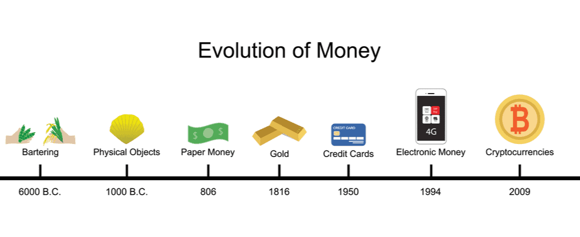

## Introduction

Bitcoin, the pioneering cryptocurrency, has revolutionized the way we perceive and interact with money. Since its inception in 2009 by the enigmatic Satoshi Nakamoto, Bitcoin has grown from a niche digital asset to a mainstream financial instrument, challenging traditional banking systems and introducing the world to blockchain technology.

## The Origins of Bitcoin

Long before Bitcoin, money has undergone significant transformations, from barter systems to coins, paper currency, and digital payments. The evolution of money has always been driven by the need for more efficient, secure, and accessible means of exchange.

Ideas for digital cash can be traced back to the 1980s with the development of cryptographic protocols. However, it wasn't until the publication of the Bitcoin whitepaper in 2008 that the concept of a decentralized digital currency gained traction.

Bitcoin was created in response to the 2008 financial crisis, with the aim of providing a decentralized alternative to traditional fiat currencies. Satoshi Nakamoto was the inventor of Bitcoin and the original author of its whitepaper, titled "Bitcoin: A Peer-to-Peer Electronic Cash System." Published in 2008, the whitepaper outlined the principles and mechanics of Bitcoin, introducing concepts such as decentralized consensus, proof-of-work, and the blockchain.

### Satoshi Nakamoto 💰

The true identity of Satoshi Nakamoto remains a mystery. Various individuals have been speculated to be Nakamoto, but none have been definitively proven. Nakamoto's vision for Bitcoin was outlined in the original whitepaper, which emphasized decentralization, security, and resistance to censorship. The name "Satoshi Nakamoto" is believed to be a pseudonym, and the individual or group behind it has not been publicly active since 2010. Despite this, Nakamoto's creation has had a lasting impact on the world of finance and technology.

## Impact on the Financial Landscape 

Bitcoin's impact on the global financial landscape has been profound. It has introduced the concept of decentralized finance (DeFi), enabling individuals to have greater control over their assets. The rise of Bitcoin has also spurred the development of thousands of other cryptocurrencies, each with unique features and use cases.

Moreover, Bitcoin has become a popular investment vehicle, attracting both retail and institutional investors. Its limited supply of 21 million coins has led to comparisons with gold, earning it the moniker "digital gold." As a result, Bitcoin has been increasingly viewed as a hedge against inflation and economic uncertainty.

## Terminology Behind Bitcoin

- **Blockchain**: A decentralized ledger that records all Bitcoin transactions across a network of computers.
- **Mining**: The process by which new Bitcoins are created and transactions are verified on the blockchain.
- **Wallet**: A digital tool that allows users to store, send, and receive Bitcoin.
- **Private Key**: A secret code that allows the owner to access and manage their Bitcoin holdings.
- **Public Key**: A cryptographic code that allows others to send Bitcoin to a user's wallet.
- **Halving**: An event that occurs approximately every four years, reducing the reward for mining new blocks by half, which helps control Bitcoin's supply.

## Programming and Technology Behind Bitcoin

Bitcoin's underlying technology is built on a combination of cryptographic principles and distributed computing. The Bitcoin protocol is implemented in C++, and its open-source nature has allowed developers worldwide to contribute to its development and improvement.

Bitcoin transactions are verified through a consensus mechanism known as Proof of Work (PoW), which requires miners to solve complex mathematical puzzles to add new blocks to the blockchain. This process ensures the integrity and security of the network, making it resistant to fraud and censorship.

## Languages Used in Bitcoin Development

- **C++**: The primary programming language used for Bitcoin Core, the reference implementation of the Bitcoin protocol.
- **Python**: Used for various Bitcoin-related tools and libraries, including testing frameworks.
- **JavaScript**: Utilized in web-based wallets and applications that interact with the Bitcoin network.
- **Go**: Employed in some alternative Bitcoin implementations and related projects.
- **Rust**: Gaining popularity for its performance and safety features, used in some Bitcoin-related projects.
- **Solidity**: Used for developing smart contracts on platforms that interact with Bitcoin, such as wrapped Bitcoin on Ethereum.
- **SQL**: Used for managing databases in Bitcoin-related applications and services.
- **Shell Scripting**: Used for automating tasks related to Bitcoin node management and deployment.

## Challenges Facing Bitcoin

Despite its successes, Bitcoin faces several challenges that could impact its long-term viability. Scalability remains a significant concern, as the network can only process a limited number of transactions per second, leading to delays and higher fees during periods of high demand.

Regulatory scrutiny is another hurdle, with governments worldwide grappling with how to classify and manage cryptocurrencies. Additionally, environmental concerns have been raised due to the high energy consumption associated with Bitcoin mining.

## Predictions for the Future of Bitcoin

The future of Bitcoin is a topic of much debate and speculation. Some experts believe that Bitcoin will continue to gain mainstream adoption, potentially becoming a global reserve currency. Others argue that regulatory challenges and technological limitations could hinder its growth.

Despite these uncertainties, Bitcoin's underlying technology and the growing interest in decentralized finance (DeFi) suggest that it will remain a significant player in the financial landscape.

## Fun Fact 🥚

Did you know that the mysterious creator of Bitcoin, known as Satoshi Nakamoto, has mined approximately 1 million Bitcoins? These coins have never been moved or spent, leading to much speculation about their fate. This stash is worth billions of dollars at current market prices, making it one of the largest single holdings of Bitcoin in existence!

---

Additional Resources:
- [Bitcoin Whitepaper](https://bitcoin.org/bitcoin.pdf)
- [Understanding Blockchain Technology](https://www.investopedia.com/terms/b/blockchain.asp)
- [Bitcoin Core GitHub Repository](https://github.com/bitcoin/bitcoin)